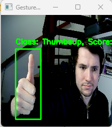

# Object Detection Tutorial

This project aims to develop a real-time gesture recognition system using a camera feed, leveraging machine learning models fine-tuned on custom gesture data for accurate detection and classification of hand gestures like thumbs-up, thumbs-down, fist, and index finger pointing.

This tutorial provides step-by-step instructions for fine-tuning an object detection model to identify custom gestures in a video feed.

**Note**: This tutorial is intended for Windows machines and requires a powerful machine with a GPU for local training.

## Prerequisites

Before you begin, ensure that you have the following prerequisites in place:

1. [Anaconda](https://www.anaconda.com/) is installed as the base environment for this project.

2. [TensorFlow 2 Object Detection API](https://tensorflow-object-detection-api-tutorial.readthedocs.io/en/latest/install.html) is installed. Follow the provided tutorial for installation.

3. Verify TensorFlow installation:
```bash
python -c "import tensorflow as tf; print(tf.reduce_sum(tf.random.normal([1000, 1000])))"
```
4. Ensure CUDA Toolkit and CUDNN are installed properly.

5. Download the TensorFlow model repository and ensure it's accessible in a different folder than this repository. [TensorFlow Models Repository](https://github.com/tensorflow/models)

6. Install Protobuf and add it to the system PATH.

7. Install COCO API:
- Navigate to the TensorFlow Models repository: `models/research/`
- Replace `"cp object_detection/packages/tf2/setup.py ."` with `"copy object_detection\packages\tf2\setup.py ."`
- Test the installation:
  ```
  python object_detection/builders/model_builder_tf2_test.py
  ```
- If you encounter issues with protobuf, refer to [this solution](https://stackoverflow.com/questions/71759248/importerror-cannot-import-name-builder-from-google-protobuf-internal).

8. Install specific protobuf version:
- Go to `C:\Users\UserName\anaconda3\envs\EnvName` (Not the place where protobuf was installed earlier but the place where it is stored within the new environment).
- Navigate to `.../Lib/site-packages/google/protobuf/internal`.
- Copy `builder.py` to Documents.
- Run `pip install protobuf==3.19.4`.
- Copy the `builder.py` file back to its original location and test again.

## Data Preparation

1. Generate training images by running:
python generateSamples.py

- You will see the video feed and can record samples by pressing the corresponding keys (`'u'` for thumbs up, `'d'` for thumbs down, `'f'` for fist, `'i'` for index finger).

2. Label the generated samples by running:
python annotateSamples.py

- Mark the corresponding area by clicking and releasing the mouse.
- Press `'s'` if you are happy with the label; press `'d'` to retry.

3. Convert the labeled data into a format compatible with the TensorFlow Object Detection API:

python prepareData.py

- Don't forget to update the `label_map` to connect labels with class numbers if you have different gestures.

## Model Download and Configuration

1. Download the model `ssd_mobilenet_v2_fpnlite_320x320_coco17_tpu-8`:
python DownloadModel.py

2. Configure the training process:
- Navigate to the newly downloaded model folder.
- Rename the checkpoint folder to "cp" to prevent issues.
- In the downloaded folder, modify the `pipeline.config` file:
  - Specify the paths (use forward slashes) for:
    - Checkpoint: `C:/Users/UserName/ObjectDetectionTutorial/ssd_mobilenet_v2_fpnlite_320x320_coco17_tpu-8/cp/ckpt-0`
    - Label Path: `C:/Users/UserName/ObjectDetectionTutorial/label_map.pbtxt`
    - TF Record Input Path: `C:/Users/UserName/ObjectDetectionTutorial/gestures.tfrecord`
  - Change the number of classes to 4.
  - Set `num_steps` to 2000.
  - Set `batch_size` to 16.
  - Set `fine_tune_checkpoint_type` to "detection".

## Model Fine-Tuning

Navigate to the `models/research` folder from earlier and fine-tune the model with the following two commands:

1. Train the model:
```bash 
python object_detection/model_main_tf2.py --pipeline_config_path=C:/Users/UserName/ObjectDetectionTutorial/ssd_mobilenet_v2_fpnlite_320x320_coco17_tpu-8/pipeline.config --model_dir=C:/Users/UserName/ObjectDetectionTutorial/ssd_mobilenet_v2_fpnlite_320x320_coco17_tpu-8/ --alsologtostderr
```
2. Export the model:
```bash 
python object_detection/exporter_main_v2.py --pipeline_config_path=C:/Users/UserName/ObjectDetectionTutorial/ssd_mobilenet_v2_fpnlite_320x320_coco17_tpu-8/pipeline.config --trained_checkpoint_dir=C:/Users/UserName/ObjectDetectionTutorial/ssd_mobilenet_v2_fpnlite_320x320_coco17_tpu-8/ --output_directory=C:/Users/UserName/ObjectDetectionTutorial/ssd_mobilenet_v2_fpnlite_320x320_coco17_tpu-8/saved_model
```
## Testing the Model

1. Navigate back to this Git repository.
2. Modify the `live.py` script and change the path to your model's saved_model directory (usually saved_model twice).
3. Run the following command to test the new model:

python live.py

Enjoy real-time gesture detection with your fine-tuned model!

